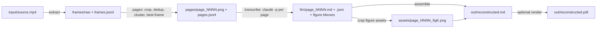

# video2document — Project Plan

Reconstruct a document from a screen-recorded video of someone scrolling through it.
The pipeline extracts frames, isolates one clean image per page, transcribes each page
with a vision-capable CLI LLM, and assembles a semantic Markdown document (plus an
optional rendered PDF).

This plan is the execution guide: work through the milestones in order, one or more
per session. Every stage communicates through **filesystem contracts** (PNG/JSONL/MD),
so each stage is independently runnable, inspectable, and resumable.

---

## 1. Locked-in decisions (v1 scope)

| Decision | Choice | Consequence |
|---|---|---|
| Video source | **Clean screen recordings only** | Viewport is stable → detect the crop **once**, reuse for all frames. No per-frame perspective warp. |
| Scroll mode | **Page-fit**: every page is fully visible at some moment | No stitching. Pick the best frame per page cluster. |
| Text extraction | **LLM-vision-first** | No PaddleOCR/Tesseract in v1. Page PNG goes straight to the LLM, which emits Markdown. Classical OCR is a v2 cross-check if hallucination shows up. |
| LLM engine | **Claude Code (`claude -p`)**, behind a pluggable interface | `codex exec` and `llm` are alternate backends implementable later with zero pipeline changes. |
| Output | **Markdown, semantically complete** + assets + optional PDF | Tables reproduced as Markdown tables; charts/figures/images preserved by **cropping them from the page PNG** and embedding them as image files. 100% graphical match is not a goal; zero semantic loss is. Trickiest regions → embed the screenshot. |
| Doc languages | Italian + English only | Prompt handles both; output keeps the source language. |
| UX | **Staged subcommands** (`v2d extract`, `v2d pages`, `v2d transcribe`, `v2d assemble`, `v2d run`) | Re-runnable per stage; `run` chains everything. |
| Stack | Python, **uv + pyproject.toml**, package `video2document`, console script `v2d` | Modern, reproducible. |

### Explicitly deferred (do NOT build in v1)

- **Zoom handling** — future videos may zoom into charts/graphs, which crops the page.
  v2 will need zoom-segment detection (scale change between frames) and mapping zoomed
  crops back onto their parent page. v1 design must not preclude this: the page manifest
  keeps per-frame provenance so zoom segments can later attach extra detail images to a page.
- **Continuous-scroll stitching** (pages never fully visible).
- **Camera-filmed screens/paper** (per-frame quad detection + perspective warp).
- **OCR cross-check** (PaddleOCR/Tesseract to validate LLM transcription; OCRmyPDF searchable-PDF artifact).

### Where this plan deviates from deep-research.md (deliberate)

deep-research.md recommends an OCR-first stack (PaddleOCR extracts source-of-truth text,
the LLM only repairs structure), a searchable image-PDF as the canonical audit artifact,
and `llm` as the orchestration CLI. This plan deviates in three places — each a conscious
trade against engineering weight, chosen in the planning Q&A:

1. **LLM-vision transcribes directly** (no OCR engine in v1). The research's hallucination
   concern is answered by the strict no-guess prompt, the `[unclear]` policy, per-page
   isolation, and the `report.md` audit — and the OCR cross-check is v2 candidate #2,
   triggered the moment a real run shows silent invention.
2. **No searchable image-PDF in v1.** Its audit role is played by `pages/*.png` (kept
   forever as canonical evidence) plus the report; OCRmyPDF stays on the v2 shelf.
3. **`claude -p` instead of `llm` as primary engine** — daily-driver familiarity; the
   `Engine` seam keeps `llm` one adapter away. The research's licensing caution about
   Claude Code doesn't apply here: it is invoked as an operator subprocess, never linked
   or redistributed.

Everything else follows the research: stage order, filesystem contracts, the
pHash→SSIM→Laplacian scoring chain with its starting thresholds (Hamming ≤ 6,
SSIM ≥ 0.985), process-not-library integration, the licensing stance, and fail-loud
handling of unsupported scroll modes.

### Recording guidelines (capture quality is the ceiling)

No pipeline recovers pixels that were never captured — and when the document can be
exported directly (Save as PDF, print-to-PDF, browser export), skip the video entirely.
When a video is the only option:

- Record at native screen resolution; the page should be **≥ 1000 px wide** in the video.
- Viewer in **fit-page, single-page view** (not two-page spread); page with PgDn/PgUp —
  no smooth scrolling.
- Pause ~1 second per page; keep the cursor parked in a margin, never over text.
- Disable notifications/overlays; keep zoom constant for the whole recording (zoom is v2).

---

## 2. Architecture



### Filesystem contract (one working directory per video)

```text
<workdir>/
  input/source.mp4
  meta/source.ffprobe.json
  frames/raw/               # extracted frames, pts-named
  manifests/
    frames.jsonl            # one line per extracted frame
    viewport.json           # the single crop rectangle for the whole video
    pages.jsonl             # one line per detected page
  pages/page_0001.png ...   # one clean, cropped image per page
  llm/
    page_0001.md            # per-page transcription
    page_0001.json          # figures bboxes, confidence, warnings
  assets/page_0001_fig1.png # cropped figures/charts referenced by the md
  out/
    reconstructed.md
    reconstructed.pdf       # optional
    report.md               # QA summary: pages, warnings, unclear spans
```

### Manifest schemas

`manifests/frames.jsonl` — one JSON object per frame:

```json
{"frame_id": 731, "pts_ms": 24366.7, "path": "frames/raw/0000024366.png",
 "phash": "ffd7918181c9ffff", "hamming_prev": 2, "laplacian_var": 183.4,
 "page_cluster": 12, "is_best": false}
```

`extract` fills identity/pts (plus a throwaway full-frame hash for exact-duplicate
dropping); `phash`, `hamming_prev`, `laplacian_var`, `page_cluster`, `is_best` are
(re)written by `v2d pages` on the **cropped** frames.

`manifests/pages.jsonl` — one JSON object per page:

```json
{"page": 12, "source_frame_id": 731, "pts_ms": 24366.7,
 "image": "pages/page_0012.png", "cluster_size": 47,
 "detail_images": []}
```

`detail_images` stays empty in v1 — it is the v2 hook for zoomed-in crops of charts.

`llm/page_NNNN.json` — LLM structured sidecar:

```json
{"page": 12, "language": "it", "confidence": "high",
 "figures": [{"id": "fig1", "bbox_pct": [12.0, 30.5, 88.0, 62.0],
              "caption": "Figura 3 — Andamento mensile", "kind": "chart"}],
 "header": null, "footer": "Pagina 12 di 30", "page_number": "12",
 "unclear": ["riga 14: importo illeggibile"],
 "continues_from_prev": true, "continues_to_next": false}
```

`bbox_pct` is `[x1, y1, x2, y2]` as **percentages of page width/height** — vision LLMs
give approximate boxes, so the figure-cropping step adds a configurable padding
(default ~2%) and that is acceptable given "no 100% graphical match" requirement.

---

## 3. Pipeline stages (the subcommands)

### `v2d extract <video> [--workdir DIR] [--fps 6]`

1. `ffprobe -of json` → `meta/source.ffprobe.json`.
2. `ffmpeg` frame extraction at a capped rate (default 6 fps; scrolling documents don't
   need more), PNG output named by pts, `-vsync 0 -frame_pts 1`. Add `mpdecimate` to the
   filter chain — screen recordings are mostly static, and dropping near-identical frames
   at decode keeps disk sane (a 10-min video at 6 fps would otherwise be ~3600 full-res
   PNGs, i.e. gigabytes). `--format jpg` as escape hatch if disk is still a problem.
3. Build `manifests/frames.jsonl`: identity + pts, plus a **full-frame** pHash used only
   to drop exact consecutive duplicates early. The authoritative pHash/Laplacian scores
   are computed by `v2d pages` **after** viewport cropping — scoring the raw frame would
   be diluted by static chrome (same principle as the research's "SSIM only after
   rectification").

Libraries: **FFmpeg (subprocess)**, **OpenCV**, **imagehash**, **Pillow**.

### `v2d pages [--workdir DIR] [--viewport auto|x,y,w,h] [--hamming 6] [--ssim 0.985]`

The heart of v1. Five steps:

1. **Viewport detection (once)**: find the stable document region across a sample of
   frames **spread over the whole video** — the axis-aligned rectangle whose content
   changes while the surroundings (browser chrome, taskbar, scrollbars, thumbnail
   sidebar) stay static. Method: per-pixel temporal variance over ~50 sampled frames →
   threshold → bounding rectangle of the largest connected component, padded a few %;
   fall back to `--viewport x,y,w,h` manual override. Write `manifests/viewport.json`.
   *Always render a `manifests/viewport_preview.png` (first frame + rectangle overlay)
   so the user can eyeball it.*
2. **Crop** every frame to the viewport (in memory or to `frames/cropped/`, decided at
   implementation time by disk-usage tolerance).
3. **Cluster into pages**: recompute pHash on the **cropped** frames; consecutive frames
   within the Hamming threshold belong to the same page cluster; a scroll transition
   (distance spike) separates clusters. Optional second-pass SSIM (scikit-image, on
   ~512-px-wide grayscale, `data_range=255`) to merge clusters that pHash split
   spuriously. Distinguish **pages from transitions by persistence**: a page's content
   is stable for a while; a transition frame lasts only ~1 sample. Because M1's
   `mpdecimate` collapses each stable dwell to a single frame, dwell duration is read
   from **pts gaps** in `frames.jsonl` (gap to the next frame; for the last frame,
   `duration_s − pts`), *not* from cluster size — large gap ⇒ page, ~1-frame gap ⇒
   transition (discard). With `--no-decimate`, equivalently use cluster size.
4. **Best frame per cluster**: screen recordings have no motion blur, so frames inside a
   stable cluster are near-identical — Laplacian variance is just the tiebreak (it also
   rejects the occasional mid-render frame); prefer mid-cluster frames over cluster
   edges. Save as `pages/page_NNNN.png`, record in `pages.jsonl`.
5. **Revisit merge**: the user may scroll back to re-check a page. Compare cluster
   representatives globally; non-adjacent clusters within the Hamming threshold are the
   **same page revisited** → merge them (keep the best frame overall), order pages by
   first appearance. (Known limitation: two genuinely identical pages — e.g. blank
   separators — collapse into one; acceptable, visible in the report's cluster timeline.)

Known traps (from deep research): compare sharpness **within** a cluster only, never
across pages; scrollbars/cursors inside the viewport cause tiny pHash noise → the
Hamming threshold absorbs it, and the cursor can also be masked later if needed.

Libraries: **OpenCV**, **imagehash**, **scikit-image** (SSIM only), **numpy**.

### `v2d transcribe [--workdir DIR] [--engine claude|codex|llm] [--pages 3,7-9] [--force]`

For each `pages/page_NNNN.png` without an up-to-date `llm/page_NNNN.md`:

1. Call the engine (default `claude -p`) with the page image attached and a strict
   system prompt (see §4). One page per call — isolation keeps hallucination local
   and makes retries cheap.
2. Expect **sentinel-delimited sections** back (`===V2D_MARKDOWN===` … `===V2D_JSON===`),
   *not* fenced blocks — a transcribed page may itself contain ``` code fences, which
   would break fence-based parsing. Split on sentinels, validate the JSON (jsonschema),
   retry once on malformed output.
3. Crop `figures[].bbox_pct` regions (+padding) from the page PNG into `assets/`,
   and rewrite the figure placeholders in the page md to ``.
   Degenerate bbox (inverted, out of range, near-zero area) → fall back to embedding
   the **full page PNG** for that figure and flag it in the sidecar/report.

Engine adapter interface (the only pluggable seam in v1):

```python
class Engine(Protocol):
    def transcribe_page(self, image: Path, prompt: str) -> str: ...
# claude:  claude -p "<prompt>" --allowedTools "Read" ... (image path in prompt, Read-only)
# codex:   codex exec --ephemeral "<prompt>"
# llm:     llm -m <model> -a page.png -s "<prompt>"
```

Always pass **absolute** image paths (headless `claude` resolves Read against its own cwd).

Resume logic: skip pages whose `.md` exists unless `--force`; `--pages` for selective
re-runs. This is what makes multi-day, page-by-page iteration cheap.

### `v2d assemble [--workdir DIR] [--pdf] [--no-merge-pass]`

1. Concatenate page markdowns in page order into `out/reconstructed.md`.
2. **Boundary healing**: where page N has `continues_to_next` and page N+1 has
   `continues_from_prev`, join the split paragraph/table (drop the repeated heading,
   merge the sentence, concatenate table rows). Deterministic first; an optional LLM
   merge pass (page-boundary text pairs only, not whole pages) fixes what heuristics miss.
3. **Header/footer suppression**: the LLM already routes running headers/footers/page
   numbers into the sidecar; assemble **verifies** each one by digit-insensitive
   repetition across ≥60% of pages ("Pagina 3 di 10" ≈ "Pagina 4 di 10" — exact-line
   matching would miss numbered footers). Confirmed → stays out of the body (document
   title kept once at the top); unconfirmed → re-inserted into the body, since the LLM
   probably misclassified a real heading.
4. `out/report.md`: page count, per-page confidence, all `unclear` items, figures
   extracted, boundaries healed — the 5-minute human QA checklist.
5. `--pdf`: render `reconstructed.md` → `out/reconstructed.pdf` with **pandoc**
   (weasyprint as alternative if pandoc/LaTeX proves annoying on WSL). PDF is an
   additive convenience; the Markdown is canonical.

### `v2d run <video> [--workdir DIR] [--pdf] ...`

Chains extract → pages → transcribe → assemble, stopping with a clear message on any
stage failure. Each stage still writes its artifacts, so a failed run resumes mid-way.

---

## 4. The transcription prompt (v1 draft)

System prompt essentials — tune during M3:

- *Role*: "You transcribe one page of a document from a screenshot. Output MUST be two
  sections delimited by `===V2D_MARKDOWN===` and `===V2D_JSON===` (sidecar schema below)."
  Sentinels, not fences: the page content may itself contain code fences.
- *Fidelity*: transcribe **exactly** what is on the page, in the page's language
  (Italian or English — never translate). Do not summarize, do not improve wording,
  do not complete truncated sentences.
- *Structure*: headings → `#` levels by visual hierarchy; lists as lists; **tables as
  GitHub Markdown tables** (if a table is too complex/irregular to represent, declare
  it as a figure instead so it gets embedded as an image — never drop cells).
- *Figures*: every chart/image/diagram/logo → a `figures[]` entry with `bbox_pct`,
  a `kind`, the visible caption, plus a one-line description in the md at its position:
  `` (placeholder rewritten by the pipeline after cropping).
- *Headers/footers*: running header/footer and page number go into the sidecar fields
  (`header`/`footer`/`page_number`), **not** into the markdown body — assemble
  cross-checks them across pages.
- *Uncertainty*: unreadable/ambiguous spans → `[unclear: …]` inline **and** an entry
  in `unclear[]`. Never guess numbers, names, amounts, dates.
- *Continuity*: set `continues_from_prev`/`continues_to_next` when the page starts/ends
  mid-sentence or mid-table.

Anti-hallucination stance for v1: strict prompt + `unclear` markers + per-page isolation
+ the `report.md` audit list. If real-world runs still show silent invention, that is
the trigger to add the v2 OCR cross-check stage.

---

## 5. Milestones (multi-day execution checklist)

Each milestone ends with something runnable and verifiable. Sizes are rough sessions,
not calendar days.

### M0 — Scaffolding (½ session)
- [ ] `uv init`, `pyproject.toml`, package `video2document/`, console script `v2d` (typer or argparse-based CLI skeleton with the 5 subcommands stubbed)
- [ ] `README.md` (short: what it is, install, usage — grows with each milestone)
- [ ] `.gitignore` (workdirs, `__pycache__`, venv), first commit + push
- [ ] Record 2–3 **fixture videos** yourself (short: a 3-page PDF paged with PgDn in fit-page mode; one Italian, one English, one with a table + a chart; at least one includes a **back-scroll**, i.e. revisiting an earlier page). Keep the **source PDFs** next to the fixtures — they are free ground truth for accuracy checks. Store outside git or via LFS; document how to regenerate them.

### M1 — `v2d extract` (done)
- [x] ffmpeg/ffprobe resolver (system, else bundled `imageio-ffmpeg`); fps cap + `mpdecimate`; sequential PNGs
- [x] `frames.jsonl` with accurate pts (parsed from `showinfo`); normalized `source.meta.json` via ffprobe-or-imageio
- [x] Verified on fixtures (en_simple → 9 frames, en_backscroll → 17) + unit/integration tests (21 passing)

### M2 — `v2d pages` (done)
- [x] Viewport auto-detection (temporal variance) + `--viewport x,y,w,h` override + preview PNG
- [x] Anchored pHash runs + persistence (pts-gap) page/transition split (SSIM pass deferred — not needed on fixtures)
- [x] Best-frame (Laplacian) selection; revisit merge; `pages/` + `pages.jsonl`
- [x] **Acceptance met**: en_simple → 3 pages; en_backscroll `[0,1,2,1,0]` → 3 (no duplicates); it_table_chart crops capture table + chart cleanly. Unit + integration tests (29 passing). Defaults `--hamming 6`, `--min-page-ms 400`.

### M3 — `v2d transcribe` with Claude engine (1–2 sessions)
- [ ] Engine protocol + `claude -p` adapter (headless, image input, retry-on-malformed)
- [ ] Prompt v1, jsonschema validation of sidecar
- [ ] Figure bbox cropping → `assets/`, placeholder rewrite
- [ ] Resume/skip/`--pages`/`--force` logic
- [ ] **Acceptance**: Italian + English fixture pages transcribe correctly; table page yields a valid MD table; chart page yields a cropped asset that actually contains the chart. Automated: normalized text diff of each page vs `pdftotext` of the fixture's source PDF (cheap character-error proxy) — target ≥ 99% match on clean text pages.

### M4 — `v2d assemble` + `v2d run` (1 session)
- [ ] Concatenation, boundary healing (deterministic), header/footer suppression
- [ ] `report.md`; `v2d run` end-to-end
- [ ] **Acceptance**: full fixture video → `reconstructed.md` with no lost content vs manual reading of the source doc; pdftotext diff re-run on the merged output (catches content lost during boundary healing / header suppression).

### M5 — PDF render + QA hardening (1 session)
- [ ] pandoc (or weasyprint) rendering, images included, decent defaults for A4
- [ ] Optional LLM boundary-merge pass
- [ ] Run on a **real** target video; log every failure mode into `docs/issues.md`

### M6 — Polish (ongoing)
- [ ] Config file for thresholds (`v2d.toml` per workdir), `--verbose` logging
- [ ] Second engine adapter (`llm` CLI is the cheapest to add) to prove the seam
- [ ] Unit tests for clustering/healing on synthetic manifests; smoke test on a tiny fixture in CI (transcribe mocked)

### v2 candidates (in likely order of need)
1. **Zoom segments**: detect scale changes, map zoomed crops to parent page via `detail_images` (schema hook already in place).
2. **OCR cross-check**: PaddleOCR on each page, diff vs LLM output, flag divergences in `report.md`.
3. **Continuous-scroll stitching** (y-axis alignment on cropped frames).
4. **Camera-filmed input** (per-frame quad detection + `warpPerspective`).
5. Searchable image-PDF artifact via OCRmyPDF, if an audit-grade artifact becomes necessary.

---

## 6. Dependencies and repo usage

Runtime deps (v1): `opencv-python`, `imagehash`, `Pillow`, `scikit-image`, `numpy`,
`typer` (or stdlib argparse), `jsonschema`. External executables: `ffmpeg`/`ffprobe`,
`claude`, `pandoc` (only for `--pdf`).

Per the deep research, **no third-party repo code is vendored** — everything is used
as a library or external process (clean licensing: Apache/BSD/MIT/LGPL-dynamic):

| Repo/tool | Role in v1 | Note |
|---|---|---|
| FFmpeg | frame extraction (subprocess) | LGPL build is fine, we don't link |
| OpenCV | Laplacian sharpness, viewport detection, figure cropping | Apache-2.0 |
| imagehash | pHash dedup/clustering | BSD |
| scikit-image | SSIM merge pass | BSD |
| Claude Code | vision transcription engine (subprocess) | operator tool, not a linked dependency |
| pandoc | MD → PDF | subprocess |
| `andrewdcampbell/OpenCV-Document-Scanner` | **reference reading only** (v2 camera mode) | no license published — never copy code |
| PaddleOCR, OCRmyPDF, PySceneDetect | v2 shelf | not installed in v1 |

---

## 7. Risks and mitigations

| Risk | Mitigation |
|---|---|
| LLM hallucinates plausible text (numbers, names) | Strict prompt, `[unclear]` policy, per-page isolation, `report.md` audit; v2 OCR diff if it materializes |
| Figure bboxes from the LLM are sloppy | Padding on crop; worst case the figure crop includes some surrounding text — acceptable per requirements |
| Page cluster count wrong (missed/duplicated pages) | Tunable thresholds + `viewport_preview.png` + cluster stats in manifest; fixtures with known page counts as regression tests |
| Smooth-scroll videos sneak in (not page-fit) | Detect and **fail loudly**: if clusters are all tiny/continuous, print "this looks like continuous scroll — unsupported in v1" |
| Transcription cost/time on long docs | Resume logic + `--pages`; frames capped at 6 fps; one LLM call per page, not per frame |
| Disk usage: full-res PNG frames pile up (10-min video ≈ thousands of frames, GBs) | `mpdecimate` at decode + fps cap; `--format jpg` fallback; workdir on Linux FS |
| Cursor/highlight parked over text in every frame of a cluster | Recording guidelines (cursor in margin); v1.5: pick an alternate in-cluster frame when occlusion is reported |
| Confidential documents leave the machine (LLM API) | Choose engine per document sensitivity; a local `llama.cpp` adapter is the offline path (v2, same `Engine` seam) |
| WSL/Windows path friction (repo lives on /mnt/c) | Keep workdirs on the Linux side (`~/v2d-work/...`) for I/O speed; only code lives on /mnt/c |

---

## 8. Working agreement (how we execute this plan)

- One milestone (or a checkbox subset) per session; tick boxes in this file as we go.
- Every session ends with: code committed, fixtures still passing, README updated if the CLI surface changed.
- Decisions that deviate from this plan get a one-line entry in a `docs/decisions.md` log.
