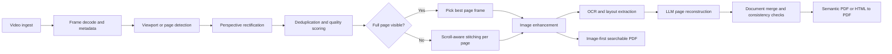
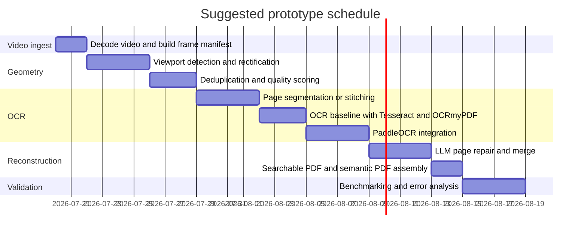

# Robust Pipeline for Reconstructing a Scrolled Document Video into Per-Page Images and a Rebuilt PDF

## Executive summary

The strongest first prototype is an **image-first, audit-friendly pipeline** built around **FFmpeg/PyAV for decoding**, **OpenCV for detection and rectification**, **PaddleOCR as the primary OCR/layout engine**, **OCRmyPDF for searchable PDF assembly**, and a **CLI LLM layer** used only after OCR to repair reading order, lists, headings, tables, and page-level semantic structure. That stack is attractive because the core components are mature, active, and mostly permissively licensed: FFmpeg is mainly LGPL with optional GPL components, PyAV is BSD-3-Clause, OpenCV is Apache-2.0, PaddleOCR is Apache-2.0, OCRmyPDF is MPL-2.0, and Simon Willison’s `llm` CLI is Apache-2.0. FFmpeg, OpenCV, PaddleOCR, OCRmyPDF, Codex, Claude Code, `llama.cpp`, and `llm` all showed active releases or current documentation in 2026, while OCRmyPDF explicitly describes itself as battle-tested on millions of PDFs. citeturn16view0turn32view1turn32view3turn16view2turn15view2turn14view3turn42view3turn42view2turn15view5turn14view4turn36search9

For a **robust v1**, I would not start with LayoutLMv3 or a heavy layout foundation model in the page-boundary stage. docTR and PaddleOCR are much better fits for the OCR and text-region stages because they ship explicit text detection and recognition model zoos, whereas LayoutLMv3 is a multimodal document foundation model for Document AI tasks built on text, layout, and image signals rather than a direct page detector. In practice, the best ordering is: **decode frames → rectify viewport/page → deduplicate and pick sharp frames → stitch or segment into page canvases if needed → OCR/layout extraction → LLM reconstruction → searchable PDF plus semantic export**. citeturn25view0turn27view1turn27view2turn17view5turn38view1

The most important design choice is to produce **two deliverables**, not one. First, produce a **searchable image PDF** that preserves visual fidelity and is easy to validate. Second, produce a **semantic reconstruction** in Markdown/JSON/HTML from OCR plus page images, then render that to PDF if you need cleaner text selection and downstream editing. This dual-output strategy contains LLM hallucination risk, because the image-first PDF remains the canonical audit artefact while the semantic reconstruction is an explicitly derived layer. OCRmyPDF already supports image input, PDF/A output, deskew, cleaning, and OCR text placement below the source image; Google’s Document AI and Cloud Vision, and Azure/AWS managed OCR offerings, likewise expose structured page/block/paragraph/word hierarchies when you need a managed alternative. citeturn13view3turn14view3turn38view0turn38view1turn34search1turn34search2

## End-to-end pipeline



A robust production flow should be implemented as eight explicit stages.

**Ingest and decode.** Use FFmpeg as the default decoder and PyAV when you need programmatic frame access in Python. FFmpeg’s repo ships documentation and examples, and PyAV is explicitly positioned as “Pythonic bindings for FFmpeg’s libraries” for precise access to containers, streams, packets, codecs, and frames. In practice, decode every frame or a capped rate such as 6–10 fps for scrolling documents, but always keep original timestamps in a manifest because page-transition detection depends more on temporal order than on file names. citeturn16view0turn16view1turn32view3turn32view5

**Detect the visible document region.** If the video is a clean screen recording, estimate the stable viewport once and reuse it. If it is a camera recording of a screen or paper, detect the page quadrilateral per frame or per stable segment. OpenCV gives you the necessary primitives: edge detection, Hough line detection, geometric transforms, `getPerspectiveTransform`, and `warpPerspective`. The classical path is still the best first pass: Canny edges → Hough or contour proposal → four-corner estimate → perspective warp. OpenCV’s document-scanner ecosystem also shows that this approach works well in practice; the `OpenCV-Document-Scanner` reference repo reports 92.8% corner detection on its 280-image test set, but because that repo exposes **no licence in the fetched GitHub page**, it is best treated as an algorithm reference rather than code to embed. citeturn30view0turn30view1turn29view0turn31view0

**Rectify and normalise.** Once corners are known, warp every candidate frame into a canonical page canvas. OpenCV’s transform documentation is clear that geometric transforms work by inverse mapping from destination pixels to source pixels, and that interpolation choice matters: `INTER_AREA` is preferred for decimation, while `INTER_CUBIC` and `INTER_LANCZOS4` are available for higher-quality resampling. Use those defaults consistently so that deduplication and stitching operate on normalised page geometry. citeturn29view0

**Deduplicate, stabilise, and choose the best frame.** Use a two-stage filter. First, collapse near-identical frames cheaply with perceptual hashing. The `imagehash` project supports perceptual hash, average hash, difference hash, wavelet hash, and crop-resistant hash, and computes Hamming distances directly. Second, run a slower SSIM pass on the surviving rectified grayscale frames. `scikit-image`’s `structural_similarity` requires matching shapes and recommends passing `data_range` explicitly for floating-point images; it also documents the Gaussian-weighted option. For sharpness selection, use variance of Laplacian on grayscale images, ideally after a light Gaussian blur because OpenCV’s Laplacian tutorial itself shows Gaussian blur before grayscale/Laplacian, and blur-detection practice built on variance of the Laplacian treats the threshold as domain-specific. citeturn41view0turn40view0turn30view2turn30view3turn40view1

**Split into per-page canvases.** There are two operating modes. In **page-fit mode**, where the entire page becomes visible during scrolling, select the single best rectified frame for that page. In **continuous-scroll mode**, where each page is rarely fully visible, build a page canvas by aligning rectified frames along the scroll axis and stitching them before OCR. For a first prototype, translation-only y-axis alignment on rectified images is usually enough. Only escalate to full feature-matching plus homography when you see camera movement, keystone drift, or rolling perspective. OpenCV’s perspective tooling is strong enough for this, and docTR/PaddleOCR can provide additional text-region masks when classical page-boundary detection is unreliable. citeturn29view0turn25view0turn27view1

**Enhance images before OCR.** OCRmyPDF is the cleanest backbone here because it already knows how to deskew, clean, rotate pages, validate outputs, preserve embedded image resolution, and generate searchable PDF/A. For lighter or more custom enhancement, use `unpaper` for scanned-page cleanup, `scikit-image` for denoising and thresholding, and ImageMagick for deterministic CLI transforms. I would treat OCRmyPDF’s enhancement hooks as the production path and lower-level image tools as fallback or experimentation layers. citeturn14view3turn13view3turn16view4turn16view5turn16view6turn39view0

**Run OCR and layout extraction.** Use **PaddleOCR** first when you want an actively developed OCR and document-parsing stack with current multilingual detectors/recognisers and LLM-oriented structured outputs. Its repo now positions itself explicitly as bridging documents/PDFs to LLMs, and its current docs expose PP-OCRv5 detection, PP-OCRv6 recognition, text-line orientation models, and PP-Structure recovery. Keep **Tesseract** as your deterministic fallback, especially inside OCRmyPDF, because it remains widely deployed, ships an LSTM engine, and integrates naturally with hOCR/PDF workflows. Use **docTR** where you want a clean PyTorch OCR stack with explicit detection models such as DBNet, LinkNet, and FAST and recognition models such as SAR, CRNN, ViTSTR, PARSeq, and VIPTR. Managed APIs such as **Cloud Vision** and **Document AI** become attractive when you need hosted OCR with block/paragraph/word hierarchies, language hints, rotation correction, or image-quality scoring. citeturn15view2turn27view1turn27view2turn27view0turn27view4turn14view2turn25view0turn38view0turn38view1

**Use a CLI LLM only after OCR.** Simon Willison’s `llm` is the most flexible orchestration surface because it supports model plugins, attachments, stdin, system prompts, and structured extraction from text and images. Codex is excellent when you want a scripted agent that can read local files and run in non-interactive `codex exec` mode. Claude Code is strong when you want file-aware batch reasoning through `claude -p` and a controlled `--allowedTools` set. `llama.cpp` is the best local/offline route when you want a vision-capable local model with `--image` input and a file-based prompt. The LLM should not be your primary OCR engine; it should reconcile OCR text, page image, and layout metadata into a strict schema or Markdown with confidence annotations. citeturn37view0turn37view1turn37view2turn37view3

## Repository shortlist and integration map

The table below prioritises repositories for **frame extraction and page detection/rectification**.

| Priority | Repository or tool | Why it belongs in the stack | Maturity | Licence and language | Key files or algorithms | Recommended integration |
|---|---|---|---|---|---|---|
| High | **FFmpeg/FFmpeg** | Best default decoder and batch frame extractor; repo includes docs/examples; ideal for a first CLI stage. citeturn16view0turn32view1 | Very mature; 62.2k stars and 429 tags visible on GitHub. citeturn32view1 | Mainly LGPL with optional GPL components; mostly C. citeturn16view0turn32view0 | `doc/`, `doc/examples`, filter and transform tooling. citeturn16view0 | Use as a subprocess to decode frames and emit timestamps before any Python stage. |
| High | **PyAV-Org/PyAV** | Thin, precise Python access to FFmpeg streams/frames when you need frame-wise scoring and manifests in Python. citeturn16view1turn32view3 | Mature and current; 3.2k stars, latest release v18.0.0 on 2026-07-02. citeturn32view3turn32view5 | BSD-3-Clause; Python/Cython. citeturn32view3turn32view4 | `av/`, `examples/`, `docs/`, `tests/`. citeturn32view3 | Use inside the scoring/manifest builder if FFmpeg CLI alone is not flexible enough. |
| High | **opencv/opencv** | Core CV toolkit for contouring, Hough lines, perspective transforms, interpolation, deskew support, and later stitching. citeturn16view2turn29view0turn30view1 | Extremely mature; 90k stars on GitHub. citeturn16view2 | Apache-2.0; primarily C++. citeturn16view2 | `modules/imgproc`, `docs`, `findHomography`/`getPerspectiveTransform`/`warpPerspective`, `HoughLinesP`, Laplacian. citeturn29view0turn30view1turn30view3 | Make it the page-detection and rectification backbone in Python. |
| Medium | **Breakthrough/PySceneDetect** | Optional for segmenting stable camera/scroll segments before deeper analysis; includes content-aware detectors and FFmpeg splitting. citeturn33view0turn33view1 | Healthy and active; 5k stars, latest release v0.7 on 2026-05-03. citeturn33view0 | BSD-3-Clause; Python. citeturn33view0 | `scenedetect` API with `ContentDetector`, `AdaptiveDetector`, `ThresholdDetector`. citeturn33view0 | Use only if videos contain pauses, cuts, or major camera movement; skip for clean screen recordings. |
| Medium | **andrewdcampbell/OpenCV-Document-Scanner** | Useful task-specific reference for automatic corner detection, sharpening, and adaptive thresholding. citeturn31view0 | Small and static; 633 stars, 8 commits, no releases. citeturn31view0 | **No explicit licence surfaced in the fetched repo page**; Python. citeturn31view0 | `scan.py`, `polygon_interacter.py`, `pyimagesearch/`. citeturn31view0 | Treat as a reference notebook or prototype inspiration; do not copy code into a redistributable product without verifying rights. |
| Medium | **Layout-Parser/layout-parser** | Good secondary tool for downstream document layout analysis and DL wrappers, not page-boundary detection itself. citeturn16view7turn17view0 | Useful but slower-moving; latest release shown is April 2022. citeturn17view2 | Apache-2.0; Python. citeturn17view0turn17view1 | `src/layoutparser`, model wrappers such as EfficientDet/PubLayNet. citeturn17view0 | Add only after OCR if you need refined block/figure/table segmentation. |
| Low | **microsoft/unilm LayoutLMv3** | Important for semantic document understanding, but it is a **downstream understanding model**, not a first-choice page detector. citeturn17view5 | High-profile parent repo, but LayoutLMv3 itself is a model family rather than an operational page-crop solution. citeturn17view4turn17view5 | Repo is MIT; model-use terms should be checked separately. citeturn17view4 | UNILM model zoo; LayoutLMv3 is positioned for Document AI. citeturn17view5 | Use later for structure recovery or key information extraction, not to find the page quadrilateral. |

The next table covers **preprocessing, OCR, and PDF assembly**.

| Priority | Repository or tool | Why it belongs in the stack | Maturity | Licence and language | Key files or algorithms | Recommended integration |
|---|---|---|---|---|---|---|
| High | **ocrmypdf/OCRmyPDF** | Best end-stage PDF backbone: searchable PDF/A, deskew, cleaning, validation, multi-core processing, OCR hooks, plugin architecture, image input. citeturn14view3turn13view3turn39view0 | Very mature; explicitly “battle-tested on millions of PDFs”. citeturn13view3 | MPL-2.0; primarily Python. citeturn20view2 | `src/ocrmypdf`, `bin/`, plugin hooks such as `filter_ocr_image()`, `get_ocr_engine()`, `generate_pdfa()`. citeturn20view2turn39view0 | Use to assemble searchable image PDFs even if OCR text came from a plugin or a different engine. |
| High | **PaddlePaddle/PaddleOCR** | Strongest open-source OCR candidate for this use case: current text detection, recognition, orientation, and structure recovery, plus positioning as LLM-ready document parsing. citeturn15view2turn27view1turn27view2turn27view4 | Very active; 85.8k stars, latest release v3.7.0 on 2026-06-11. citeturn15view2 | Apache-2.0; mostly Python. citeturn15view0 | `ppocr`, `ppstructure`, `configs`, `deploy`; PP-OCRv5 detectors, PP-OCRv6 recognisers, PP-Structure recovery. citeturn20view0turn27view1turn27view2turn27view4 | Make this the primary OCR/layout extractor; export JSON/Markdown-like structures per page where possible. |
| High | **tesseract-ocr/tesseract** | Deterministic, well-understood OCR fallback; ships the CLI `tesseract` and the LSTM engine added in Tesseract 4. citeturn14view2 | Mature and current; latest release 5.5.2 on 2025-12-26. citeturn14view2 | Apache-2.0; C++. citeturn14view2 | Main engine plus tessdoc guidance on page segmentation modes and quality tuning. citeturn22search0turn22search2 | Keep as OCRmyPDF default fallback and for CPU-only environments. |
| High | **mindee/doctr** | Clean PyTorch OCR stack with explicit detector/recogniser model zoo, useful when you want a pure-Python deep OCR pipeline without Tesseract legacy assumptions. citeturn25view0 | Active; latest release v1.0.1 on 2026-02-04. citeturn15view3 | Apache-2.0; Python. citeturn15view3turn20view1 | `doctr/`, `references/`, model zoo with DBNet, LinkNet, FAST, SAR, CRNN, ViTSTR, PARSeq, VIPTR. citeturn20view1turn25view0 | Use as the main OCR engine if you prefer docTR’s API or want model-level experimentation. |
| Medium | **unpaper/unpaper** | Still one of the simplest CLI cleaners for scanned pages. citeturn16view4 | Established classic utility. citeturn16view4 | GPLv2 with some per-file exceptions; C. citeturn16view4 | Post-process scanned sheets; noise cleanup, border cleanup. citeturn16view4 | Use as an optional external executable before OCR when dirty scans are a major issue. |
| Medium | **scikit-image/scikit-image** | Excellent Python toolbox for thresholding, denoising, morphology, and SSIM. citeturn16view5turn40view0 | Mature scientific stack. citeturn16view5 | BSD-style project licence; Python. citeturn16view5 | `skimage.metrics.structural_similarity`, denoise and threshold modules. citeturn40view0 | Use in the scoring/preprocessing stage, not as the full OCR backbone. |
| Medium | **ocrmypdf/OCRmyPDF-EasyOCR** | The cleanest example of swapping OCR engines inside OCRmyPDF. It is explicitly experimental and still relies on Tesseract for some operations. citeturn20view5turn39view0 | Early-stage plugin. citeturn20view5 | MIT; Python. citeturn20view5 | `ocrmypdf_easyocr/`, `tests/`, plugin entry points. citeturn20view5 | Use when you want GPU-backed EasyOCR but keep OCRmyPDF orchestration. |
| Medium | **clefru/ocrmypdf-paddleocr** | Promising bridge between PaddleOCR and OCRmyPDF, including GPU options, angle classification control, hOCR conversion, and word-box improvements. citeturn21view0 | Early; 44 stars, 11 commits, no releases, active issues in 2026. citeturn21view0turn19search14 | MPL-2.0; Python/Nix. citeturn21view0 | `src/ocrmypdf_paddleocr`, `CLAUDE.md`, `pyproject.toml`. citeturn21view0 | Strong candidate if you want one command for PaddleOCR-driven searchable PDFs; budget time for hardening. |
| Medium | **googleapis/google-cloud-python with Cloud Vision / Document AI** | The SDK repo is mature and Apache-2.0, and the managed products expose document hierarchies, PDF/TIFF ingestion, rotation correction, deskew, quality scores, and language hints. citeturn18view1turn38view0turn38view1 | Production-grade managed path. citeturn18view1 | Apache-2.0; Python SDK, cloud service terms apply separately. citeturn18view1 | `packages/` in the SDK repo; Cloud Vision `DOCUMENT_TEXT_DETECTION`; Document AI Enterprise OCR. citeturn18view1turn38view0turn38view1 | Use when you can accept per-page API cost and external processing in exchange for less OCR engineering. |

The final table covers **CLI LLM integrations**.

| Priority | Repository or tool | Why it belongs in the stack | Maturity | Licence and language | Key files or behaviours | Recommended integration |
|---|---|---|---|---|---|---|
| High | **simonw/llm** | Best orchestration CLI for mixed providers; supports plugins, stdin, system prompts, attachments, SQLite logging, and structured extraction from text and images. citeturn42view3turn37view0 | Active; latest release 0.31.1 on 2026-07-09. citeturn13view7 | Apache-2.0; Python. citeturn42view3 | `llm/`, `docs/`; `llm prompt`, attachments with `-a`, system prompt via `-s`. citeturn20view4turn37view0 | Make this the default LLM orchestration surface for page-level repair and structured extraction. |
| High | **openai/codex** | Strong file-aware local agent for scripted, repository-based page reconstruction tasks. Non-interactive `codex exec` is designed for CI and pipelines. citeturn42view2turn37view1 | Very active; 99.6k stars, latest release 0.144.6 on 2026-07-18. citeturn14view4turn42view2 | Apache-2.0; mostly Rust. citeturn42view2turn13view4 | `codex exec`; local file-aware workflow. citeturn37view1 | Excellent when the LLM should read local OCR JSON and write normalised Markdown/JSON results. |
| High | **ggml-org/llama.cpp** | Best local/offline route; CLI supports prompt files and multimodal inputs including `--image`. Ideal when data cannot leave the machine. citeturn15view5turn37view3 | Extremely active; 121k stars, latest build b10068 on 2026-07-18. citeturn15view5 | MIT; C/C++. citeturn15view5 | `tools/cli/README.md`, `llama-cli`, prompt files, system prompts, multimodal projector options. citeturn37view3 | Use with a vision-capable GGUF model if privacy or offline inference matters most. |
| Medium | **anthropics/claude-code** | Excellent headless reasoning tool for page repair and file-aware workflows; `claude -p` supports non-interactive mode, bare mode, tool allow-lists, and structured output. citeturn37view2turn36search0 | Very active and widely used; 138k stars and current weekly docs. citeturn13view5turn36search9 | GitHub page exposes a licence file but the fetched accessible lines did not expose a simple SPDX label; verify current terms before bundling. Language is mainly Python. citeturn42view0turn13view5 | `claude -p`, `--bare`, `--allowedTools`, `--output-format`; plugin and MCP surfaces. citeturn37view2turn36search14 | Good operator tool; use it as an external headless assistant rather than as a linked code dependency unless you have already reviewed the licensing terms. |

**Recommended default stack.** If you want the lowest-risk build order, use **FFmpeg → OpenCV → PaddleOCR → OCRmyPDF → `llm`**. Keep **Tesseract/OCRmyPDF** as the conservative fallback path and **Cloud Vision / Document AI** as the managed off-ramp. citeturn16view0turn16view2turn15view2turn14view3turn42view3turn38view0turn38view1

## Algorithms and parameter recommendations

The table below gives the most practical defaults for a prototype. Where exact thresholds are shown, treat them as **starting heuristics** that should be re-tuned on a labelled sample from your own videos.

| Problem | Recommended default | Starting parameters | Why this is the right first choice |
|---|---|---|---|
| Page boundary detection in camera video | OpenCV classical detection on a downscaled frame, then perspective warp on full resolution. citeturn30view0turn30view1turn29view0 | Canny edges, then `HoughLinesP(rho=1, theta=π/180, threshold=50, minLineLength=50, maxLineGap=10)` as a first line-finder; if that fails, fall back to largest 4-point contour or a text-hull from docTR/PaddleOCR. citeturn30view1turn25view0turn27view1 | The OpenCV tutorial itself uses those Hough defaults as an example, and OpenCV provides the exact perspective primitives needed to turn four points into a rectified page. citeturn30view1turn29view0 |
| Rectification and resizing | Use `getPerspectiveTransform` + `warpPerspective` for rectification; for downscaling use `INTER_AREA`, for higher-quality upscaling use `INTER_CUBIC` or `INTER_LANCZOS4`. citeturn29view0 | Canonical page width 1600–2200 px for OCR; maintain aspect ratio. | OpenCV’s own transform docs recommend `INTER_AREA` for decimation and expose the higher-quality interpolation modes for enlargement. citeturn29view0 |
| Frame deduplication | Two-pass filter: pHash first, then SSIM on rectified grayscale. citeturn41view0turn40view0 | Start with pHash Hamming distance ≤ 6 as “same view”, then SSIM ≥ 0.985 on 512-px-wide grayscale crops with `data_range=255`. | `imagehash` is built precisely for near-identical visual matching, while `scikit-image` documents SSIM and explicitly warns that `data_range` should be set for floating-point images. The numeric thresholds are sensible prototype defaults, not canonical constants. citeturn41view0turn40view0 |
| Sharpest-frame selection | Variance of Laplacian after grayscale conversion and a light Gaussian blur. citeturn30view3turn40view1 | Start by rejecting frames below a calibrated threshold from your data, then choose the max score inside each duplicate cluster. | OpenCV’s Laplacian tutorial shows blur-before-Laplacian, and practical blur scoring with Laplacian variance is fast, simple, and domain-dependent by design. citeturn30view3turn40view1 |
| OCR engine choice | Primary: PaddleOCR. Fallback: Tesseract inside OCRmyPDF. Optional alternate Python stack: docTR. Managed option: Document AI / Cloud Vision. citeturn15view2turn14view2turn25view0turn38view0turn38view1 | PaddleOCR: start with server models on GPU, mobile models on edge CPUs. Tesseract page segmentation: `--psm 6` for clean rectified blocks, `--psm 3` when layout varies, `--psm 4` for likely single-column reading with variable sizes. citeturn27view1turn27view2turn22search0turn22search2 | PaddleOCR now has the broadest openly documented document stack in this set; Tesseract remains the most predictable fallback and integrates cleanly with OCRmyPDF. |
| Orientation correction | Prefer Paddle text-line orientation classification or OCRmyPDF/Tesseract page rotation. citeturn27view0turn13view3 | Keep orientation classification enabled by default; only disable it if it becomes a measurable source of errors. | Paddle’s orientation module is explicitly intended to improve OCR robustness in scanned and photographed documents. citeturn27view0 |
| Page-structure recovery | Use OCR output with bounding boxes first; add PP-Structure or LayoutParser later if tables/figures matter. LayoutLMv3 is optional semantic enrichment, not a page cropper. citeturn27view4turn17view0turn17view5 | Preserve page/block/paragraph/word coordinates in intermediate JSON. | This keeps the first version simple and auditable while leaving a clean upgrade path to richer document understanding. |
| OCR post-processing | Unicode normalisation, dehyphenation across line breaks, repeated header/footer suppression across pages, confidence-aware paragraph merging, and explicit `[unclear]` markers for low-confidence regions. | Use page-to-page repeated n-gram matching to identify headers/footers; never let the LLM silently “repair” low-confidence spans without a trace. | Cloud Vision and Document AI expose hierarchical output, PaddleOCR exposes structure/layout stages, and OCRmyPDF plugins can replace the OCR engine while keeping the searchable-PDF renderer. citeturn38view0turn38view1turn27view4turn39view0 |

A few algorithmic choices deserve emphasis. **Homography and perspective warping** should come before OCR whenever the source is a filmed screen or page, because OCR engines do much better on a normalised top-down page than on keystoned frames. **SSIM should only be computed after rectification**, otherwise page motion masquerades as visual difference. **Laplacian blur scores should be compared inside duplicate clusters**, not across the entire video, because different pages naturally have different edge density. These are implementation inferences from the behaviour documented by OpenCV, `imagehash`, and `scikit-image`. citeturn29view0turn41view0turn40view0turn30view3

I would also draw a hard boundary between **OCR** and **LLM reconstruction**. Let OCR produce source-of-truth text and coordinates. Let the LLM produce only one of two things: either **strict structured JSON** under a schema, or **page Markdown/HTML** with explicit uncertainty markers. Do not ask the LLM to transcribe raw page images in v1 when you already have OCR text available; use the page image only to resolve layout ambiguities, page numbers, headers, footers, table continuity, and broken reading order. That is where the CLI LLM tools are strongest. citeturn37view0turn37view1turn37view2turn37view3

## Prototype implementation and evaluation

The cleanest prototype uses **filesystem contracts** between stages. That matters more than framework choice. A good directory layout is:

```text
input/
  source.mp4
meta/
  source.ffprobe.json
frames/
  raw/
  rectified/
  candidates/
manifests/
  frames.jsonl
  pages.jsonl
pages/
  page_0001.png
  page_0002.png
ocr/
  page_0001.txt
  page_0001.hocr
  page_0001.json
llm/
  page_0001.md
  page_0001.json
out/
  searchable.pdf
  reconstructed.md
  reconstructed.pdf
```

That structure cleanly separates visual artefacts, OCR artefacts, and LLM artefacts, and it makes debugging much easier because every stage is inspectable by page number. OCRmyPDF’s plugin model and the CLI-oriented behaviour of `llm`, Codex, Claude Code, and `llama.cpp` all fit this style well. citeturn39view0turn37view0turn37view1turn37view2turn37view3

A practical ingest step is:

```bash
ffprobe -v error -show_streams -show_format -of json input/source.mp4 > meta/source.ffprobe.json
ffmpeg -i input/source.mp4 -vsync 0 -frame_pts 1 frames/raw/%010d.png
```

FFmpeg is the right default here because it is the most mature decoder in the set and is straightforward to call from scripts. If you need programmatic access in Python rather than image-sequence output, replace the second command with a PyAV-based reader that writes the same `frames.jsonl` contract. citeturn16view0turn16view1

The next stage should be a Python rectification/scoring script that reads `frames/raw/*.png`, writes `frames/rectified/*.png`, and appends one JSON line per frame to `manifests/frames.jsonl`. Each JSON object should contain at minimum:

```json
{
  "frame_id": 731,
  "pts_ms": 24366.7,
  "raw_path": "frames/raw/0000000731.png",
  "rectified_path": "frames/rectified/0000000731.png",
  "crop_quad": [[x1,y1],[x2,y2],[x3,y3],[x4,y4]],
  "phash": "ffd7918181c9ffff",
  "ssim_prev": 0.9912,
  "laplacian_var": 183.4,
  "candidate": true,
  "page_cluster": 12
}
```

This manifest becomes the backbone for every later decision: deduplication, best-frame selection, error analysis, and reproducibility. The use of pHash, SSIM, and Laplacian variance is directly aligned with the documented capabilities of `imagehash`, `scikit-image`, and OpenCV-based Laplacian scoring. citeturn41view0turn40view0turn30view3turn40view1

For OCR, a conservative baseline path is:

```bash
tesseract pages/page_0001.png stdout --psm 6 -l eng > ocr/page_0001.txt
ocrmypdf --deskew --clean --rotate-pages -l eng pages/page_0001.png out/page_0001.searchable.pdf
```

That gives you a quick page-level baseline using Tesseract and an auditable searchable-PDF output path through OCRmyPDF. Tesseract documentation confirms the role of page segmentation modes, and OCRmyPDF’s README documents `--deskew`, `--rotate-pages`, multi-language operation, and image-to-PDF conversion. citeturn22search0turn22search2turn13view3

A stronger open-source OCR path, especially on GPU, is to produce a stitched pages PDF and then run the PaddleOCR plugin through OCRmyPDF:

```bash
ocrmypdf --plugin ocrmypdf_paddleocr --paddle-use-gpu -l eng stage/pages.pdf out/searchable.pdf
```

The plugin’s README documents GPU mode, language mapping, angle classification control, and hOCR conversion back into OCRmyPDF’s PDF renderer. Because this plugin is early, I would keep a Tesseract fallback path in the same orchestration layer. citeturn21view0

For the LLM stage, the cleanest provider-agnostic command is usually `llm`, because it supports stdin, attachments, system prompts, and model plugins:

```bash
llm -m gpt-4.1 \
  -s "Reconstruct this OCR page as strict JSON. Preserve headings, lists, footnotes and tables. Mark uncertain spans as unclear." \
  -a pages/page_0001.png \
  < ocr/page_0001.txt > llm/page_0001.json
```

If you want file-aware local-agent behaviour, use Codex or Claude Code instead:

```bash
codex exec --ephemeral "Read pages/page_0001.png and ocr/page_0001.txt, then write llm/page_0001.md preserving document structure."
```

```bash
claude --bare -p "Read pages/page_0001.png and ocr/page_0001.txt and output valid JSON matching schema schemas/page.json" \
  --allowedTools "Read" > llm/page_0001.json
```

For local multimodal inference, `llama.cpp` supports prompt files and image inputs:

```bash
llama-cli -hf <multimodal-gguf-model> \
  --image pages/page_0001.png \
  -f prompts/reconstruct_page.txt \
  -st \
  -o llm/page_0001.md
```

Those command surfaces are all explicitly documented by their own upstream tools. citeturn37view0turn37view1turn37view2turn37view3

For assembly, I recommend merging page-level LLM outputs into `out/reconstructed.md` and separately preserving the image-first searchable PDF. If you need a text-first rebuilt PDF, render the Markdown/HTML in a final one-way step, but keep the image-first PDF as the audit baseline. OCRmyPDF’s design and managed OCR hierarchies from Google Cloud both support this dual-output mindset. citeturn13view3turn38view0turn38view1

A useful acceptance-test matrix is:

| Metric | What to measure | Good prototype target |
|---|---|---|
| Page crop success | Correct visible-page quadrilateral or viewport crop on labelled frames | ≥ 95% on a representative test set |
| Duplicate rejection precision | Fraction of dropped frames that truly add no new page content | ≥ 98% |
| Best-frame quality selection | Chosen frame vs human-picked sharpest frame inside cluster | ≥ 90% agreement |
| OCR quality | Character error rate and word error rate on annotated pages | Track by page type, language, and engine |
| Page ordering | Fraction of pages reconstructed in correct order | 100% on curated runs |
| Table/list fidelity | Human judgement on preserved structure | ≥ 4/5 average on a small rubric |
| Throughput | Pages per minute from video to searchable PDF | Track CPU-only and GPU paths separately |

The most common error cases are predictable. **Motion blur** lowers Laplacian scores and degrades OCR. **Viewer chrome** such as scrollbars, toolbars, or annotations introduces false text and must be masked. **Pages that never become fully visible** require stitching or you will lose bottom or top content. **Wrong OCR language selection** causes catastrophic recognition failures; both OCRmyPDF/Tesseract and Document AI explicitly support language packs or hints. **LLM over-correction** can silently “improve” formatting that was actually uncertain, which is why structured JSON with uncertainty markers is preferable to unconstrained prose output. citeturn13view3turn38view1



## Licensing and migration strategy

From a licensing standpoint, the safest open-source baseline is **OpenCV + PyAV + PaddleOCR + OCRmyPDF + `llm`**, because those are Apache/BSD/MPL components with clear repository-level licensing. FFmpeg is also safe if you stay within its **mainly LGPL** configuration, but you must watch its optional GPL-linked build paths. `unpaper` is GPLv2, so if you ship it as part of your distributable bundle you should plan for GPL compliance rather than treating it as a casual helper utility. citeturn16view2turn32view3turn15view0turn20view2turn42view3turn16view0turn16view4

The most robust migration pattern is to keep the system **process-oriented** rather than source-integrated. Use Python as the orchestration layer and call FFmpeg, OCRmyPDF, Tesseract, Codex, Claude Code, or `llama.cpp` as **external executables** behind stable JSONL/PNG/hOCR/Markdown contracts. That approach gives you three benefits at once: language boundaries become irrelevant, upgrades are easier, and legal review is far simpler because you are generally distributing well-identified upstream binaries or containers rather than embedding code fragments across repos. OCRmyPDF’s plugin model is also a good fit for this philosophy because it deliberately separates page rasterisation, image filtering, OCR engine substitution, and PDF/A generation. citeturn39view0turn37view1turn37view2turn37view3

There are two special cautions. First, **do not ship copied code from `OpenCV-Document-Scanner`** until you confirm its licence, because the fetched GitHub page did not expose one. Second, treat **Claude Code** as an operator-facing tool unless you have separately validated its current licence terms, because the accessible fetched lines showed a licence file but did not expose a simple SPDX label in the same way that the OpenAI Codex and `llm` repos did. By contrast, Codex and `llm` are straightforward Apache-2.0 repos and `llama.cpp` is MIT. citeturn31view0turn42view0turn42view2turn42view3turn15view5

If you later need to migrate from an all-open stack to a managed-service stack, do not rewrite the whole pipeline. Keep the **same page image and manifest contracts**, then swap only the OCR stage: open-source OCR JSON/hOCR in v1, Cloud Vision or Document AI JSON in v2, Azure/AWS OCR in v3 if needed. Google explicitly recommends Document AI for scanned documents and documents/PDFs, while still exposing Cloud Vision’s lower-latency OCR path. That makes the OCR stage the natural seam for migration. citeturn38view0turn38view1

## Risks, limitations, and alternatives

The main technical limitation is that a video of scrolling is an **indirect capture** of a document. If the page is blurred, cropped, glared, moiré-affected, partially occluded by UI chrome, or never fully visible, then perfect reconstruction may be impossible. Managed OCR can improve recognition, but it cannot recover pixels that never appeared in the source frames. Google Document AI explicitly documents quality metrics such as blurriness and glare for document routing, which is a good reminder that image quality should be measured and not assumed. citeturn38view1

The second limitation is **layout fidelity**. OCR plus LLM reconstruction can usually recover text, headings, lists, and many tables, but it will not always recreate the original pagination, font metrics, marginalia, or complex figures. That is why I strongly recommend keeping the image-first searchable PDF as the canonical artefact and treating the text-first rebuilt PDF as a convenience output. OCRmyPDF is particularly well suited to the canonical artefact because it preserves the page image while placing text accurately beneath it. citeturn14view3turn13view3

If you want to reduce engineering effort, there are good managed OCR alternatives. **Google Cloud Vision** supports dense document text detection and PDF/TIFF file OCR, while **Document AI Enterprise OCR** adds deskew, rotation correction, language hints, native-text extraction from digital PDFs, quality scores, and addon capabilities such as maths, checkboxes, and font-style detection. **Azure AI Document Intelligence** offers a high-resolution Read model for text, paragraphs, lines, words, and layout across PDFs and scanned images. **Amazon Textract** extracts text, handwriting, layout elements, and data from scanned documents and PDFs. None of those products is documented as a direct video-ingestion solution, so you would still need your own frame-extraction and page-segmentation front end. citeturn38view0turn38view1turn34search1turn34search2

One final alternative is often the best one: **avoid video entirely** whenever possible. If the original document still exists in a browser tab, PDF viewer, note-taking app, or SaaS platform, it is usually far more reliable to capture it directly through export, print-to-PDF, browser automation, or an official API than to reconstruct it from scrolling footage. The pipeline in this report is what I would build when the video is all you have, not what I would choose if I had any direct access to the source.